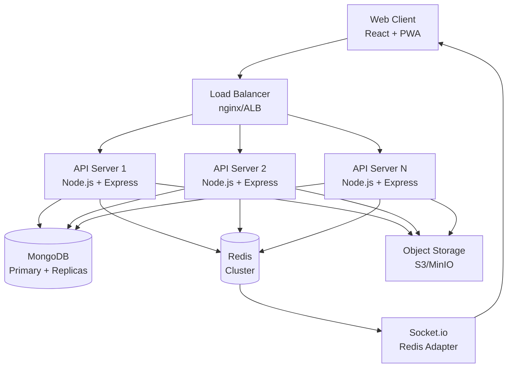
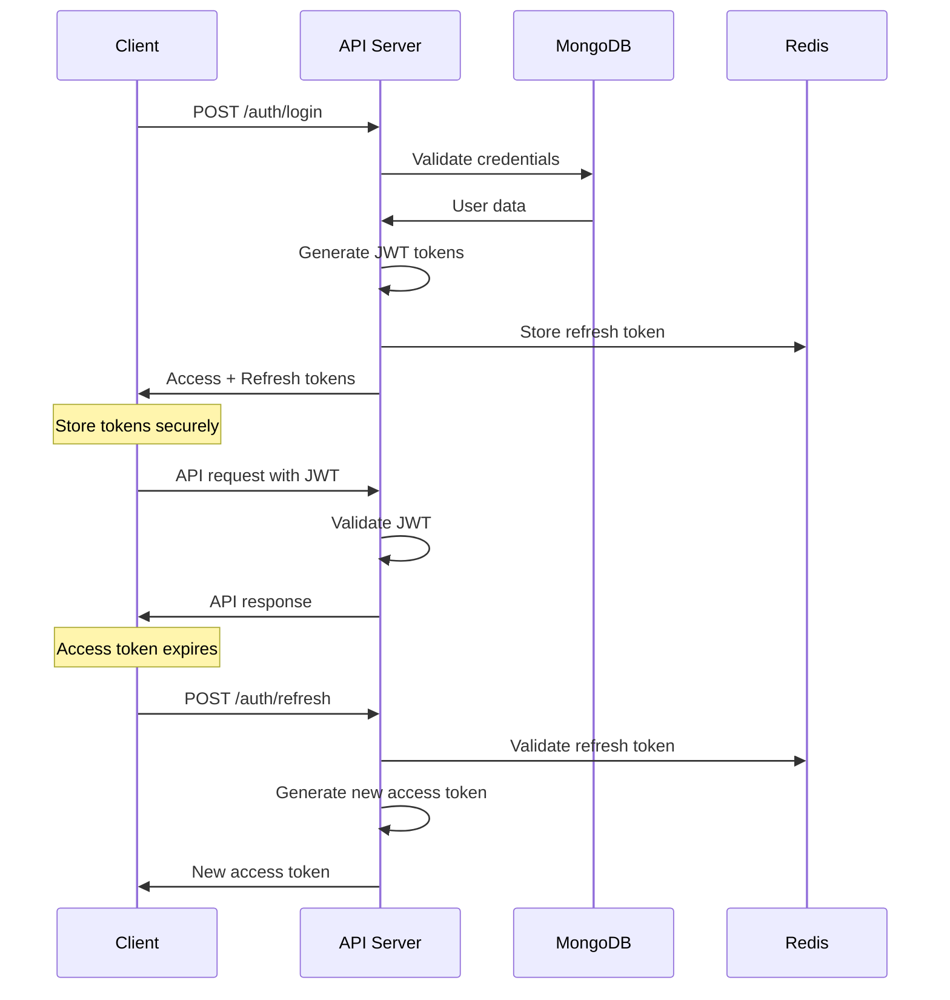
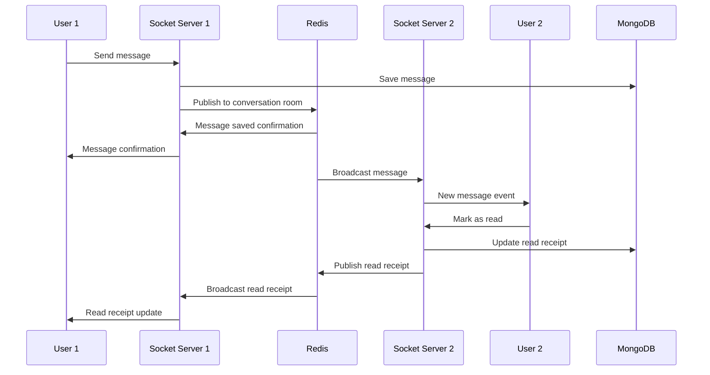
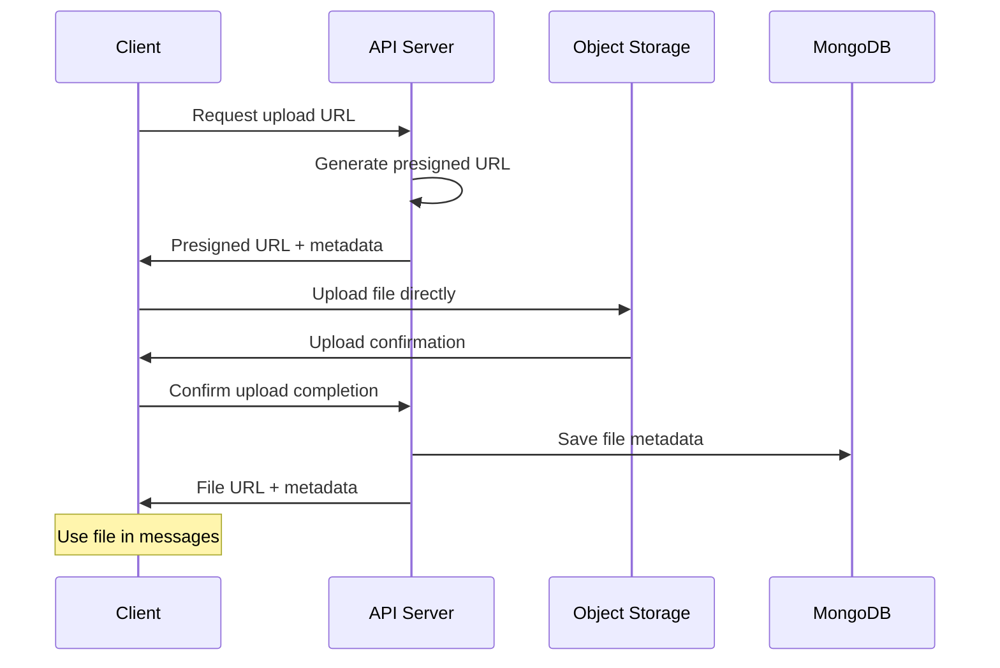

# Architecture Guide

**File: docs/ARCHITECTURE.md**

## 🏗️ System Overview

ChatVerse is built as a modern, scalable real-time messaging platform using a microservices-inspired monorepo architecture. The system is designed for high availability, horizontal scaling, and maintainability.

## 🎯 Design Principles

### 1. **Separation of Concerns**
- Clear boundaries between frontend, backend, and shared packages
- Domain-driven design with focused services
- Loose coupling with well-defined interfaces

### 2. **Real-time First**
- WebSocket-based communication for instant messaging
- Optimistic UI updates with fallback handling
- Event-driven architecture for real-time features

### 3. **Scalability**
- Stateless API servers for horizontal scaling
- Redis for shared state and pub/sub
- Database indexing for query optimization
- CDN-ready static assets

### 4. **Security by Design**
- JWT authentication with short-lived tokens
- Input validation at all layers
- Rate limiting and DDoS protection
- Optional end-to-end encryption

## 🏛️ System Architecture



## 📦 Component Architecture

### Frontend (React)
```
apps/web/
├── src/
│   ├── app/              # App-level configuration
│   │   ├── routes/       # Route components
│   │   ├── layouts/      # Layout components
│   │   └── providers/    # Context providers
│   ├── components/       # UI components
│   │   ├── chat/         # Chat-specific components
│   │   ├── common/       # Reusable components
│   │   └── upload/       # File upload components
│   ├── hooks/            # Custom React hooks
│   ├── store/            # State management (Zustand)
│   ├── services/         # API and WebSocket clients
│   └── utils/            # Helper functions
```

**Key Technologies:**
- **React 18** with hooks and concurrent features
- **TypeScript** for type safety
- **Vite** for fast development and building
- **Zustand** for lightweight state management
- **Socket.io-client** for real-time communication
- **React Query** for server state management

### Backend (Node.js)
```
apps/api/
├── src/
│   ├── config/           # Configuration management
│   ├── models/           # Database models (Mongoose)
│   ├── routes/           # Express route handlers
│   ├── controllers/      # Business logic controllers
│   ├── services/         # Domain services
│   ├── realtime/         # Socket.io event handlers
│   ├── middlewares/      # Express middlewares
│   ├── utils/            # Helper utilities
│   └── health/           # Health check endpoints
```

**Key Technologies:**
- **Node.js** with Express framework
- **TypeScript** for type safety
- **Socket.io** for real-time communication
- **Mongoose** for MongoDB object modeling
- **Redis** for caching and pub/sub
- **JWT** for authentication
- **Helmet** for security headers

## 🔄 Data Flow

### 1. Authentication Flow


### 2. Real-time Messaging Flow


### 3. File Upload Flow


## 🗄️ Database Design

### MongoDB Collections

#### Users
```typescript
{
  _id: ObjectId,
  username: string,          // Unique identifier
  email: string,             // Unique email
  displayName: string,       // Display name
  avatar: string?,           // Profile picture URL
  status: enum,              // online|offline|away|busy
  lastSeen: Date,            // Last activity timestamp
  isVerified: boolean,       // Email verification status
  password: string,          // Bcrypt hashed
  preferences: {
    theme: enum,             // light|dark|auto
    notifications: {...},    // Notification settings
    privacy: {...}           // Privacy settings
  },
  createdAt: Date,
  updatedAt: Date
}
```

#### Conversations
```typescript
{
  _id: ObjectId,
  type: enum,                // direct|group
  name: string?,             // Group name (optional)
  description: string?,      // Group description
  avatar: string?,           // Group avatar URL
  participants: string[],    // Array of user IDs
  admins: string[],          // Array of admin user IDs
  lastMessage: {
    _id: ObjectId,
    content: string,
    senderId: string,
    createdAt: Date
  },
  unreadCount: number,       // Calculated field
  isArchived: boolean,       // Archive status
  isPinned: boolean,         // Pin status
  settings: {
    isEncrypted: boolean,    // E2E encryption
    muteNotifications: boolean,
    allowInvites: boolean
  },
  createdAt: Date,
  updatedAt: Date,
  createdBy: string          // Creator user ID
}
```

#### Messages
```typescript
{
  _id: ObjectId,
  conversationId: string,    // Reference to conversation
  senderId: string,          // Reference to user
  type: enum,                // text|image|file|video|audio|system
  content: string,           // Message content/caption
  metadata: {
    fileName: string?,       // For files
    fileSize: number?,       // File size in bytes
    mimeType: string?,       // MIME type
    duration: number?,       // For audio/video
    dimensions: {            // For images/videos
      width: number,
      height: number
    }?,
    thumbnail: string?       // Thumbnail URL
  }?,
  attachments: [{
    _id: ObjectId,
    url: string,             // File URL
    fileName: string,
    fileSize: number,
    mimeType: string,
    thumbnail: string?
  }]?,
  replyTo: string?,          // Reference to replied message
  reactions: [{
    emoji: string,
    userId: string,
    createdAt: Date
  }],
  isEdited: boolean,         // Edit status
  editedAt: Date?,          // Last edit timestamp
  isDeleted: boolean,        // Deletion status
  deletedAt: Date?,         // Deletion timestamp
  readBy: [{
    userId: string,
    readAt: Date
  }],
  createdAt: Date,
  updatedAt: Date
}
```

### Database Indexing Strategy

```javascript
// Users collection
db.users.createIndex({ email: 1 }, { unique: true })
db.users.createIndex({ username: 1 }, { unique: true })
db.users.createIndex({ status: 1, lastSeen: -1 })

// Conversations collection
db.conversations.createIndex({ participants: 1, updatedAt: -1 })
db.conversations.createIndex({ type: 1, participants: 1 })

// Messages collection
db.messages.createIndex({ conversationId: 1, createdAt: -1 })
db.messages.createIndex({ conversationId: 1, isDeleted: 1, createdAt: -1 })
db.messages.createIndex({ content: "text" }) // Full-text search
db.messages.createIndex({ senderId: 1, createdAt: -1 })
```

## 🔄 Real-time Architecture

### Socket.io Event System

```typescript
// Client to Server Events
interface ClientEvents {
  authenticate: (token: string) => void;
  join_conversation: (conversationId: string) => void;
  send_message: (data: MessageData) => void;
  start_typing: (conversationId: string) => void;
  stop_typing: (conversationId: string) => void;
  update_status: (status: UserStatus) => void;
}

// Server to Client Events
interface ServerEvents {
  authenticated: (userData: User) => void;
  new_message: (message: Message) => void;
  user_typing: (data: TypingData) => void;
  user_status_changed: (data: StatusData) => void;
  message_read: (data: ReadReceiptData) => void;
}
```

### Room Management Strategy

```typescript
// Room naming convention
const ROOMS = {
  USER: (userId: string) => `user:${userId}`,
  CONVERSATION: (conversationId: string) => `conversation:${conversationId}`,
  GLOBAL: 'global'
}

// User joins their personal room and conversation rooms
socket.join(ROOMS.USER(userId))
userConversations.forEach(conv => {
  socket.join(ROOMS.CONVERSATION(conv._id))
})
```

### Redis Pub/Sub Architecture

```typescript
// Redis channels for scaling across multiple servers
const CHANNELS = {
  MESSAGE: 'message:new',
  TYPING: 'typing:update',
  STATUS: 'status:change',
  PRESENCE: 'presence:update'
}

// Publish message to all servers
redis.publish(CHANNELS.MESSAGE, JSON.stringify({
  conversationId,
  message,
  participants
}))
```

## 📈 Performance Optimizations

### 1. Database Optimizations
- **Compound indexes** for complex queries
- **Projection** to limit returned fields
- **Aggregation pipelines** for complex data transformations
- **TTL indexes** for temporary data (sessions, typing status)

### 2. Caching Strategy
```typescript
// Redis caching layers
const CACHE_KEYS = {
  USER_SESSION: (userId: string) => `session:${userId}`,
  CONVERSATION_USERS: (convId: string) => `conv:users:${convId}`,
  ONLINE_USERS: 'users:online',
  TYPING_STATUS: (convId: string) => `typing:${convId}`
}

// Cache user sessions for fast authentication
redis.setex(CACHE_KEYS.USER_SESSION(userId), 3600, JSON.stringify(user))

// Cache conversation participants for room management
redis.setex(CACHE_KEYS.CONVERSATION_USERS(convId), 1800, JSON.stringify(participants))
```

### 3. API Optimizations
- **Pagination** for large datasets
- **Field selection** with query parameters
- **Batch operations** for bulk updates
- **Response compression** with gzip

### 4. Frontend Optimizations
- **Code splitting** by route and feature
- **Lazy loading** of components
- **Virtual scrolling** for large message lists
- **Image optimization** with WebP and responsive images
- **Service Worker** for caching and offline support

## 🔐 Security Architecture

### 1. Authentication & Authorization
```typescript
// JWT token structure
interface JWTPayload {
  userId: string;
  email: string;
  iat: number;        // Issued at
  exp: number;        // Expires at
  type: 'access' | 'refresh';
}

// Token validation middleware
const authenticateToken = (req, res, next) => {
  const token = req.headers.authorization?.split(' ')[1];
  if (!token) return res.status(401).json({ error: 'No token provided' });

  jwt.verify(token, JWT_SECRET, (err, decoded) => {
    if (err) return res.status(403).json({ error: 'Invalid token' });
    req.user = decoded;
    next();
  });
};
```

### 2. Input Validation & Sanitization
```typescript
// Message validation schema
const messageSchema = Joi.object({
  conversationId: Joi.string().required(),
  type: Joi.string().valid('text', 'image', 'file', 'video', 'audio'),
  content: Joi.string().max(10000).required(),
  replyTo: Joi.string().optional()
});

// HTML sanitization for user content
const sanitizeContent = (content: string) => {
  return DOMPurify.sanitize(content, {
    ALLOWED_TAGS: ['b', 'i', 'em', 'strong', 'code'],
    ALLOWED_ATTR: []
  });
};
```

### 3. Rate Limiting Strategy
```typescript
// Different limits for different operations
const RATE_LIMITS = {
  LOGIN: { max: 5, window: '15m' },           // 5 attempts per 15 minutes
  MESSAGE: { max: 100, window: '1m' },        // 100 messages per minute
  FILE_UPLOAD: { max: 10, window: '1m' },     // 10 uploads per minute
  API_GENERAL: { max: 1000, window: '15m' }   // 1000 requests per 15 minutes
};
```

## 🚀 Deployment Architecture

### Development Environment
- **Docker Compose** for local development
- **Hot reloading** for frontend and backend
- **Shared volumes** for code changes
- **Health checks** for service dependencies

### Production Environment
```yaml
# Production scaling strategy
services:
  nginx:
    replicas: 2
  api:
    replicas: 3
    resources:
      memory: 512MB
      cpu: 0.5
  redis:
    replicas: 3 # Redis Cluster
  mongodb:
    replicas: 3 # Replica Set
```

### Kubernetes Deployment
```yaml
# API deployment with horizontal scaling
apiVersion: apps/v1
kind: Deployment
metadata:
  name: chatverse-api
spec:
  replicas: 3
  selector:
    matchLabels:
      app: chatverse-api
  template:
    spec:
      containers:
      - name: api
        image: chatverse/api:latest
        resources:
          requests:
            memory: 256Mi
            cpu: 250m
          limits:
            memory: 512Mi
            cpu: 500m
```

## 📊 Monitoring & Observability

### Health Checks
```typescript
// Liveness probe - is the app running?
app.get('/health/live', (req, res) => {
  res.status(200).json({ status: 'alive', timestamp: new Date().toISOString() });
});

// Readiness probe - is the app ready to serve traffic?
app.get('/health/ready', async (req, res) => {
  const checks = await Promise.allSettled([
    checkMongoConnection(),
    checkRedisConnection(),
    checkS3Connection()
  ]);

  const status = checks.every(check => check.status === 'fulfilled') ? 'ready' : 'not-ready';
  res.status(status === 'ready' ? 200 : 503).json({ status, checks });
});
```

### Metrics Collection
```typescript
// Prometheus metrics
const promClient = require('prom-client');

const messagesSent = new promClient.Counter({
  name: 'chatverse_messages_sent_total',
  help: 'Total number of messages sent'
});

const activeConnections = new promClient.Gauge({
  name: 'chatverse_active_connections',
  help: 'Number of active WebSocket connections'
});

const responseTime = new promClient.Histogram({
  name: 'chatverse_http_request_duration_seconds',
  help: 'HTTP request duration in seconds',
  buckets: [0.1, 0.5, 1, 2, 5]
});
```

This architecture provides a solid foundation for a scalable, maintainable, and secure real-time messaging platform.
