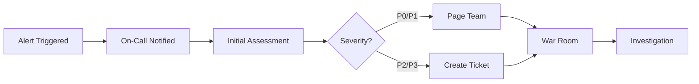

# Incident Response Runbook

**File: docs/RUNBOOKS/incidents.md**

## 🚨 Incident Classification

### Severity Levels

#### P0 - Critical (Response: Immediate)
- **Complete service outage** affecting all users
- **Security breach** with data compromise
- **Data loss** or corruption
- **Payment system failures**

#### P1 - High (Response: 1 hour)
- **Partial service outage** affecting >50% users
- **Authentication system down**
- **Database connection failures**
- **Major feature completely broken**

#### P2 - Medium (Response: 4 hours)
- **Minor feature degradation** affecting <50% users
- **Performance issues** (slow response times)
- **Integration failures** (S3, Redis, etc.)
- **Non-critical security issues**

#### P3 - Low (Response: 24 hours)
- **Minor bugs** affecting few users
- **UI/UX issues**
- **Documentation errors**
- **Non-urgent feature requests**

## 📞 Emergency Contacts

### On-Call Rotation
```
Primary: +1-555-0100 (DevOps Lead)
Secondary: +1-555-0200 (Backend Lead)
Escalation: +1-555-0300 (CTO)
Security: +1-555-0400 (Security Lead)
```

### Slack Channels
- `#incidents` - Active incident coordination
- `#alerts` - Automated monitoring alerts
- `#ops-team` - Operations team discussion
- `#security` - Security-related incidents

## 🚨 Incident Response Process

### 1. Detection & Alert


#### Alert Sources
- **Monitoring**: Prometheus, Grafana, DataDog
- **User Reports**: Support tickets, social media
- **External**: Third-party service alerts
- **Security**: SIEM, intrusion detection

#### Initial Response (Within 5 minutes)
1. **Acknowledge alert** in monitoring system
2. **Join incident channel** `#incidents-YYYY-MM-DD-NNN`
3. **Post initial status** in channel
4. **Start incident timer**

### 2. Assessment & Triage

#### Quick Health Check Commands
```bash
# Service health
kubectl get pods -n chatverse
curl -f https://api.chatverse.com/health/ready

# Database connectivity
mongosh --eval "db.adminCommand('ping')"
redis-cli ping

# Load balancer status
curl -I https://chatverse.com

# Recent deployments
kubectl rollout history deployment/chatverse-api -n chatverse
```

#### Severity Assessment Questions
- How many users are affected?
- Is the core functionality working?
- Are we losing data or revenue?
- Is there a security concern?
- Can users work around the issue?

### 3. Communication

#### Internal Communication Template
```
🚨 INCIDENT ALERT - P1
Service: ChatVerse API
Issue: High error rate on message sending
Impact: ~60% of users cannot send messages
Started: 2024-01-15 14:30 UTC
ETA: Investigating
Lead: @john.doe
Status Page: https://status.chatverse.com/incidents/123
```

#### External Communication (Status Page)
```markdown
**Investigating** - We are currently investigating reports of users being unable to send messages. We will provide updates as we learn more.

**Update** - We have identified the issue and are working on a fix. Estimated resolution in 30 minutes.

**Resolved** - The issue has been resolved. All services are operating normally.
```

### 4. Investigation & Mitigation

#### Investigation Checklist
- [ ] Check service logs for errors
- [ ] Review monitoring dashboards
- [ ] Verify database connectivity
- [ ] Check external dependencies
- [ ] Review recent deployments/changes
- [ ] Examine network/infrastructure

#### Common Investigation Commands
```bash
# Check recent logs
kubectl logs -f deployment/chatverse-api -n chatverse --since=30m

# Database performance
db.currentOp()
db.serverStatus()

# Redis status
redis-cli info
redis-cli monitor

# System resources
kubectl top nodes
kubectl top pods -n chatverse

# Network connectivity
nslookup chatverse.com
telnet redis-cluster 6379
```

#### Mitigation Strategies
1. **Rollback**: Revert to last known good version
2. **Scale Up**: Increase replica count
3. **Failover**: Switch to backup systems
4. **Circuit Breaker**: Disable problematic features
5. **Rate Limiting**: Reduce load on system

## 🔧 Common Incident Scenarios

### Scenario 1: API Service Down

#### Symptoms
- Health checks failing
- 5xx errors on all endpoints
- Users cannot access the application

#### Investigation Steps
```bash
# 1. Check pod status
kubectl get pods -n chatverse -l app=chatverse-api

# 2. Check recent deployments
kubectl rollout history deployment/chatverse-api -n chatverse

# 3. Check pod logs
kubectl logs deployment/chatverse-api -n chatverse --tail=100

# 4. Check service connectivity
kubectl exec -it deployment/chatverse-api -n chatverse -- curl localhost:3001/health/live
```

#### Resolution Steps
```bash
# Quick fix: Scale up if resource issue
kubectl scale deployment chatverse-api --replicas=5 -n chatverse

# Rollback if bad deployment
kubectl rollout undo deployment/chatverse-api -n chatverse

# Check rollout status
kubectl rollout status deployment/chatverse-api -n chatverse
```

### Scenario 2: Database Connection Issues

#### Symptoms
- Database timeout errors in logs
- MongoDB connection pool exhausted
- Users getting 500 errors on data operations

#### Investigation Steps
```bash
# 1. Check MongoDB cluster status
mongosh --eval "rs.status()"

# 2. Check connection pool
mongosh --eval "db.serverStatus().connections"

# 3. Check slow queries
mongosh --eval "db.currentOp({'secs_running': {\$gte: 5}})"

# 4. Check disk space
df -h
```

#### Resolution Steps
```bash
# 1. Scale down API to reduce connections
kubectl scale deployment chatverse-api --replicas=2 -n chatverse

# 2. Kill long-running operations
mongosh --eval "db.killOp(OPERATION_ID)"

# 3. Restart API pods with fresh connections
kubectl rollout restart deployment/chatverse-api -n chatverse

# 4. Monitor connection count
watch "mongosh --eval 'db.serverStatus().connections'"
```

### Scenario 3: High Memory Usage

#### Symptoms
- Pods getting OOMKilled
- Slow response times
- Memory usage alerts

#### Investigation Steps
```bash
# 1. Check pod resource usage
kubectl top pods -n chatverse

# 2. Check memory metrics
kubectl describe pod POD_NAME -n chatverse

# 3. Get heap dump (if Node.js)
kubectl exec -it POD_NAME -n chatverse -- kill -USR2 1

# 4. Check for memory leaks in logs
kubectl logs POD_NAME -n chatverse | grep -i "memory\|heap\|leak"
```

#### Resolution Steps
```bash
# 1. Scale horizontally instead of vertically
kubectl scale deployment chatverse-api --replicas=5 -n chatverse

# 2. Increase memory limits (temporary)
kubectl patch deployment chatverse-api -n chatverse -p '{"spec":{"template":{"spec":{"containers":[{"name":"api","resources":{"limits":{"memory":"2Gi"}}}]}}}}'

# 3. Restart pods to clear memory
kubectl rollout restart deployment/chatverse-api -n chatverse
```

### Scenario 4: WebSocket Connection Issues

#### Symptoms
- Users not receiving real-time messages
- WebSocket connection failures in browser logs
- Typing indicators not working

#### Investigation Steps
```bash
# 1. Check WebSocket endpoint
curl -H "Connection: Upgrade" -H "Upgrade: websocket" https://api.chatverse.com/socket.io/

# 2. Check Redis pub/sub
redis-cli monitor

# 3. Check Socket.io logs
kubectl logs deployment/chatverse-api -n chatverse | grep -i "socket\|websocket"

# 4. Test direct connection to pod
kubectl port-forward deployment/chatverse-api 3001:3001 -n chatverse
```

#### Resolution Steps
```bash
# 1. Restart API to clear WebSocket state
kubectl rollout restart deployment/chatverse-api -n chatverse

# 2. Check load balancer WebSocket configuration
# (Update nginx/ALB configuration if needed)

# 3. Scale up if connection limit reached
kubectl scale deployment chatverse-api --replicas=3 -n chatverse
```

## 📊 Incident Metrics & KPIs

### Response Time Targets
- **P0**: 5 minutes to acknowledge, 15 minutes to initial response
- **P1**: 15 minutes to acknowledge, 1 hour to initial response
- **P2**: 1 hour to acknowledge, 4 hours to initial response
- **P3**: 4 hours to acknowledge, 24 hours to initial response

### Success Metrics
- **MTTR (Mean Time to Resolution)**
- **MTTD (Mean Time to Detection)**
- **MTBF (Mean Time Between Failures)**
- **Incident recurrence rate**

### Incident Tracking Template
```yaml
# File: incident-template.yml
incident:
  id: "INC-2024-001"
  severity: "P1"
  title: "API service experiencing high error rate"
  description: "Users unable to send messages due to 500 errors"

timeline:
  - time: "14:30"
    event: "Alert triggered - High error rate detected"
  - time: "14:32"
    event: "Incident declared, team notified"
  - time: "14:35"
    event: "Investigation started"
  - time: "14:45"
    event: "Root cause identified - Database connection pool exhausted"
  - time: "15:00"
    event: "Mitigation deployed - Connection pool size increased"
  - time: "15:15"
    event: "Incident resolved - Error rate back to normal"

impact:
  users_affected: "~5000 users"
  duration: "45 minutes"
  revenue_impact: "$2,500 estimated"

root_cause: "Database connection pool size was insufficient for peak load"

resolution: "Increased MongoDB connection pool size from 10 to 50 connections"

prevention:
  - "Add alerts for database connection pool utilization"
  - "Load testing with production-like connection patterns"
  - "Auto-scaling based on connection pool usage"

lessons_learned:
  - "Need better visibility into database connection metrics"
  - "Connection pool sizing should be part of capacity planning"
  - "Automated rollback procedures needed for database config changes"
```

## 🔍 Post-Incident Review

### Post-Mortem Template
```markdown
# Post-Incident Review: INC-2024-001

## Summary
Brief description of the incident, impact, and resolution.

## Timeline
Detailed timeline of events from detection to resolution.

## Root Cause Analysis
### What Happened?
Technical explanation of the failure.

### Why Did It Happen?
Contributing factors and root causes.

## Impact Assessment
- **Users Affected**: X users
- **Duration**: X minutes
- **Revenue Impact**: $X
- **SLA Breach**: Yes/No

## Response Evaluation
### What Went Well?
- Fast detection through monitoring
- Effective team coordination
- Quick mitigation deployment

### What Could Be Improved?
- Delayed initial response
- Unclear communication
- Manual mitigation steps

## Action Items
- [ ] Improve monitoring for connection pool metrics (Owner: @devops, Due: 2024-01-30)
- [ ] Automate rollback procedures (Owner: @backend, Due: 2024-02-15)
- [ ] Update runbook with new procedures (Owner: @sre, Due: 2024-01-25)

## Prevention Measures
Steps to prevent similar incidents in the future.
```

### Action Item Tracking
```bash
# Create GitHub issues for follow-up actions
gh issue create --title "Add connection pool monitoring" \
  --body "Add alerts for MongoDB connection pool utilization to prevent future incidents" \
  --assignee @devops-team \
  --label "incident-followup,P1" \
  --milestone "2024-Q1"
```

## 🛠️ Tools & Resources

### Monitoring Dashboards
- **System Overview**: https://grafana.chatverse.com/d/system
- **API Metrics**: https://grafana.chatverse.com/d/api
- **Database Performance**: https://grafana.chatverse.com/d/database
- **User Experience**: https://grafana.chatverse.com/d/ux

### Useful Commands Reference
```bash
# Quick status check
./scripts/health-check.sh

# View active incidents
kubectl get events --sort-by='.metadata.creationTimestamp' -n chatverse

# Get resource usage
kubectl top pods --sort-by=memory -n chatverse

# Check recent deployments
kubectl rollout history deployment/chatverse-api -n chatverse --revision=3

# Emergency maintenance mode
kubectl patch ingress chatverse-ingress -n chatverse -p '{"spec":{"rules":[{"host":"chatverse.com","http":{"paths":[{"path":"/","pathType":"Prefix","backend":{"service":{"name":"maintenance-service","port":{"number":80}}}}]}}]}}'
```

### External Resources
- **Status Page**: https://status.chatverse.com
- **Documentation**: https://docs.chatverse.com
- **Monitoring**: https://monitoring.chatverse.com
- **Logs**: https://logs.chatverse.com

---

**For incident support: incidents@chatverse.com | On-call: +1-555-INCIDENT**

*Last updated: July 2025*
